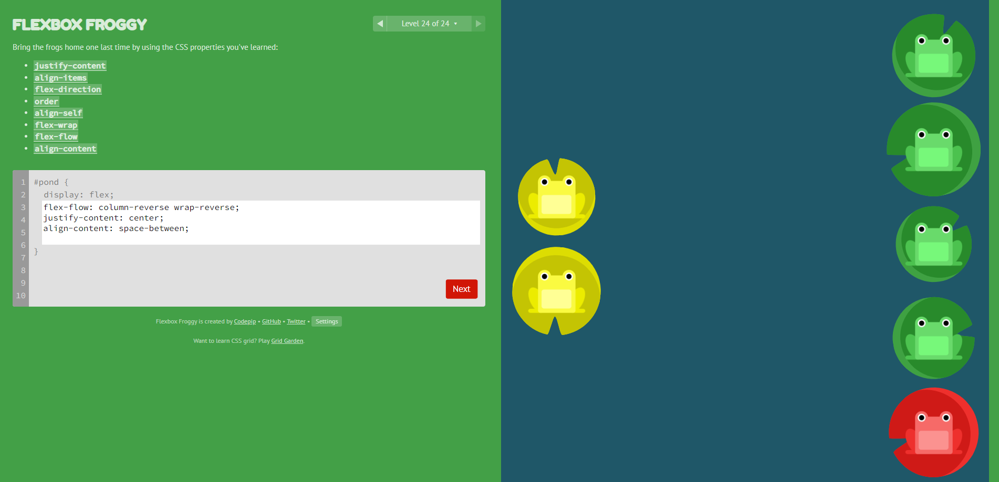
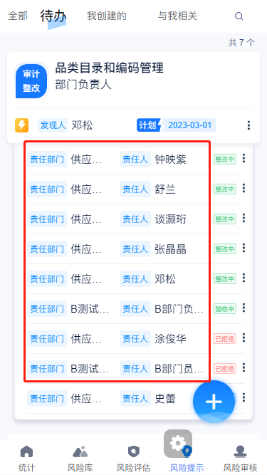
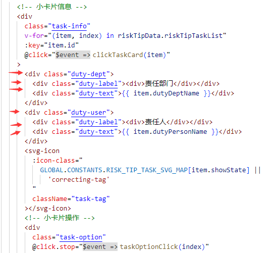

## flex布局



### flex-direction:

- row（默认值）：主轴为水平方向，起点在左端
- row-reverse：主轴为水平方向，起点在右端
- column：主轴为垂直方向，起点在上沿
- column-reverse：主轴为垂直方向，起点在下沿

### flex-wrap:

- nowrap（默认）：不换行
- wrap：换行，第一行在上方
- wrap-reverse：换行，第一行在下方

### justify-content:

- flex-start（默认值）：左对齐
- flex-end：右对齐
- center： 居中
- space-between：两端对齐，项目之间的间隔都相等
- space-around：每个项目两侧的间隔相等。所以，项目之间的间隔比项目与边框的间隔大一倍

### align-items:

- flex-start：交叉轴的起点对齐
- flex-end：交叉轴的终点对齐
- center：交叉轴的中点对齐
- baseline: 项目的第一行文字的基线对齐
- stretch（默认值）：如果项目未设置高度或设为auto，将占满整个容器的高度

### align-content:

(定义了多根轴线的对齐方式，如果项目只有一根轴线，那么该属性将不起作用)

- flex-start：与交叉轴的起点对齐
- flex-end：与交叉轴的终点对齐
- center：与交叉轴的中点对齐
- space-between：与交叉轴两端对齐，轴线之间的间隔平均分布
- space-around：每根轴线两侧的间隔都相等。所以，轴线之间的间隔比轴线与边框的间隔大一倍
- stretch（默认值）：轴线占满整个交叉轴

### align-self

- 允许单个项目有与其他项目不一样的对齐方式，可覆盖`align-items`属性，默认值为`auto`，表示继承父元素的`align-items`属性，如果没有父元素，则等同于`stretch`

### 属性

- order
- flex-grow：定义项目的放大比例，默认为`0`，即如果存在剩余空间，也不放大
- flex-shrink：定义项目的缩小比例，默认为`1`，即如果存在剩余空间，也不放大

## 超出字数的人名展示省略号

- 常用属性
  - overflow: hidden
    - 超出边框部分隐藏
    - 清除浮动---当不给父元素设置高度时，内部元素浮动，脱离标准流不占位，父元素检测不到子元素大小，高度为0（父级塌陷）；给父元素设置该属性解决问题
    - 外边距塌陷---也要给父元素设置
  - text-overflow: ellipsis
    - 文本溢出时显示省略号，但是单独使用该属性无法显示，要搭配上一属性
  - display: -webkit-box;
    - 用于移动动设备自适应布局，实现横列的流体布局
    - 与flex的区别
      - 父元素设置display:-webkit-box，父元素的外框宽度小于子元素总体宽度的时候，元素会横向排序并且溢出
      - 父素设置display:flex，父元素的外框宽度小于子元素总体宽度的时候，子元素会在父元素的宽度基础上，自动调节自身的宽度，把多余的挤掉，实现横向排列
  - -webkit-box-orient: vertical;
    - box中的子元素排列方式，纵向
  - -webkit-line-clamp: 行数;
    - 与-webkit-box和-webkit-box-orient:vertical连用
    - 用于限制块容器可能包含的行数
  - word-break: break-word;
    - 使文本自动换行
    - 与break-all的区别：前者会把整个单词换行，后者会把单词截断换行
- 举例：
  - ​
  - 
  - 为蓝色标签右侧的字体所在div设置上述常用属性

## 2.flex属性--适应移动端分辨率

- flex-grow：定义项目的放大比例，默认0，不放大

  - 所有项目为1，等分剩余空间
  - 项目为n，占据的空间是为1的n倍

- flex-shrink：定义项目的缩小比例，默认1，缩小

  - 所有项目为1，空间不足时，缩小比例相同
  - 0，项目不会缩小
  - n，空间不足，缩小比例是为1的n倍

- flex-basis：定义在分配多余空间之前，项目占据的主轴空间，浏览器根据此属性计算主轴是否有多余空间，默认auto，项目原本大小

  - 设置后将占据固定空间

- flex:none=flex:0 0 auto 不放大不缩小

- flex默认值:0 1 auto 不放大会缩小

- flex:auto=flex:1 1 auto 放大且缩小

- flex:n 即 flex-grow:n

- flex: n1 n2 即 flex-grow:n1; flex-shrink: n2

- flex: L 即flex-basis的值

- flex: n L 即flex-grow和flex-basis

- 举例：

  - 如上面图片中的责任人和责任部门，布局如下

  - 

  - 要求责任人和责任部门的内容长度超出后显示省略号，且蓝色标签和右侧tag标签必须展示完全

  - 下面是css代码

  - ```scss
    /* 每一行小卡片 */
    .task-info {
      /* 设置横向布局，不换行，高度通过padding撑起 */
        display: flex;
        flex-direction: row;
        flex-wrap: nowrap;
        align-items: center;
        padding: 9px 0;
        border-bottom: 1px solid rgba(112, 112, 112, 0.1);
      /* 蓝色标签，高度通过padding撑起，设置0 0 auto，正常展示 */
        .duty-label {
          font-weight: 400;
          box-sizing: border-box;
          font-size: 10px;
          font-weight: 400;
          color: #0084ff;
          background: rgba(0, 132, 255, 0.07);
          padding: 3px 4px;
          text-align: center;
          border-radius: 3px;
          margin-right: 5px;
          flex: 0 0 auto;
        }
      /* 蓝色标签右侧文字，要求超出的字体显示省略号 */
        .duty-text {
          font-size: 15px;
          font-weight: 400;
          color: #061637;
          flex: 1;
          @include ellipsis(1);
        }
      /* 左侧责任主体和右侧责任人flex都为1，等分剩余空间 */
        .duty-dept {
          display: flex;
          align-items: center;
          flex: 1;
          margin-right: 10px;
        }
        .duty-user {
          display: flex;
          align-items: center;
          flex: 1;
          margin-right: 10px;
        }
      /* 右侧tag标签设置0 0 auto，不受其他项目放大缩小的影响，正常展示 */
        .task-tag {
          width: 35px;
          flex: 0 0 auto;
          margin-right: 10px;
        }
        .task-option {
          position: absolute;
          height: 20px;
          width: 20px;
          right: -12px;
          .dot {
            height: 16px;
            width: 16px;
          }
        }
      }
    ```

